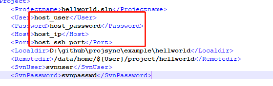
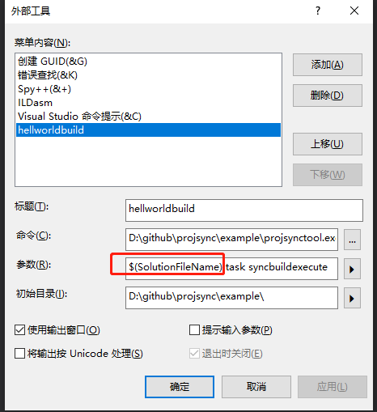
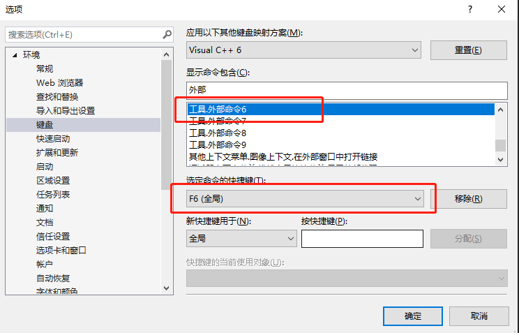
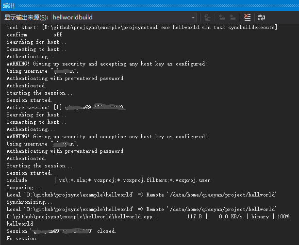

# projsync简介
本工具基于winscp实现windows本地开发机与linux远程开发机之间的工程同步。
主要功能包含一下：
- 本地目录和远程目录之间的双向同步。子目录、文件过滤机制。
- 远程命令执行。
- 组合同步、远程命令等步骤构成任务，结合visual studio, vs code, qt creator等IDE外部工具，来达成一键编译、一键部署功能。

### 依赖软件
[wscp](https://winscp.net/eng/index.php)
下载安装后，需添加程序路径到环境变量-系统变量-Path中。
添加完，在windows命令行中执行winscp，查看能否正常启动。

### 工具编译
#### 编译依赖
因为项目使用了go module，需要至少使用Go 1.11版本。在[golang主页](https://golang.org/)下载安装windows版本。
#### 编译
在power shell或者cmd，进入工程目录，然后执行
```
cd bin
go build github.com/yqjoe/projsync/projsync
go build github.com/yqjoe/projsync/projsynctool
```
生成projsync.exe、projsynctool.exe两个可执行程序。
其中projsync.exe是一个常驻server程序，需要在工作时一直保持执行，它调用winscp跟远程linux机器进行交互。
projsynctools.exe是一次执行即关闭程序，其向projsync.exe发送任务，并接收projsync.exe发回的执行过程信息并打印在屏幕。

###  使用举例
example目录有个hellworld的例子，用来说明下怎么使用projsync工具将整个工程同步到远程linux机器编译并执行。
1. 拷贝编译好的projsync.exe、projsynctool.exe两个可执行程序到example目录。
2. projsync.ini基础配置文件，可以配置多个工程。例子中，配置的工程名字为hellworld.sln，则需要有一个hellworld.sln.xml的工程配置文件与之对应。
```
projectcnt=1
taskserverport=6547
project1=hellworld.sln
```
3. hellworld.sln.xml 工程配置基础
host_user为远程linux机器用户名
host_ip为远程linux机器ip地址
host_passward为远程linux机器口令
host_ssh_port为远程linux机器ssh服务端口
注意<Projectname></Projectname>配置项必须和配置的文件名保持一致。



4. Task任务配置
示例中的任务名为syncbuildexecute。其执行一个winscp命令，该wscp命令有三个步骤，先远程linux机器上建立${Remotedir}目录(<Remotedir></Remotedir>中配置)，再同步${Localdir}目录到${Remotedir}，同步过程可配置排除某些目录或文件，最后编译目标文件并执行。
```
<Task>
    <TaskName>syncbuildexecute</TaskName>
    <TaskPrinter>yes</TaskPrinter>
    <AutoDoTaskCircle>0</AutoDoTaskCircle> <!--minute-->
    <CmdList>
        <Cmd>
            <CmdName>winscp</CmdName>
            <StepList>
                <Step>
                    <StepName>call</StepName>
                    <ShellCmdList>
                        <ShellCmd>mkdir -p ${Remotedir}</ShellCmd>
                    </ShellCmdList>
                </Step>
                <Step>
                    <StepName>sync</StepName>
                    <SyncDirection>local2remote</SyncDirection>
                    <ExcludeList>
                        <Exclude>.vs\</Exclude>
                        <Exclude>*.sln</Exclude>
                        <Exclude>*.vcxproj</Exclude>
                        <Exclude>*.vcxproj.filters</Exclude>
                        <Exclude>*.vcxproj.user</Exclude>
                    </ExcludeList>							
                </Step>
                <Step>
                    <StepName>call</StepName>
                    <ShellCmdList>
                        <ShellCmd>cd ${Remotedir}</ShellCmd>
                        <ShellCmd>gcc -o hellworld hellworld.cpp</ShellCmd>
                        <ShellCmd>./hellworld</ShellCmd>
                    </ShellCmdList>
                </Step>
            </StepList>
        </Cmd>
    </CmdList>
</Task>
```
winscp<Include></Include>及<Exclude></Exclude>选项是一个过时配置，但在最新版本也还能使用。配置说明参考下面这个链接。
https://winscp.net/eng/docs/scriptcommand_option?rev=1330502699
后续可以考虑使用synchronize命令的filemask选项来实现这个过滤机制。

5. Visual Studio配置

*Visual Studio外部工具增加一项hellworldbuild*
命令项设置为projsynctool.exe
参数设置为$(solutionFileName) task syncbuildexecute
本例子中，$(solutionFileName)为hellworld.sln，需要和projsync工程配置xml文件名保持一致。


*给新增的外部工具绑定快捷键*


6. Visual Studio执行外部命令
按下绑定好的快捷键F6，输出如下：

可看到倒数第三行，执行编译好的目标文件，输出"hellworld"